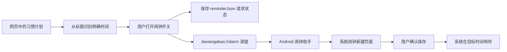

# 大象阿宝闹钟功能技术适配声明

版本：1.1（开发完成、待发布与真机验收）  
日期：2026-09-01  
适用范围：大象阿宝网页端、Android 闹钟助手 1.1.4、小米 12S Pro（用户提供系统版本 `3.0.4.0.VLECNXM`）

## 1. 声明目的

本声明说明当前项目已经具备的闹钟能力、对话联动能力，以及 Android/小米设备上的技术边界。对话确认链路已完成代码开发和自动化验证，尚未发布，也尚未完成小米 12S Pro 真机验收。

## 2. 当前适配结论

| 项目 | 当前结论 | 证据或限制 |
| --- | --- | --- |
| Android 版本范围 | 已配置支持 Android 6.0（API 23）及以上 | `android-app/app/build.gradle.kts` 中 `minSdk = 23`、`targetSdk = 35` |
| 小米 12S Pro 安装 | 硬件与 API 范围满足；仍需真机验收 | 当前没有该设备的自动化测试记录 |
| 网页打开手机助手 | 已实现 | `daxiangabao://alarm` 深链及 `CATEGORY_BROWSABLE` 已配置 |
| 任务标题时间识别 | 已实现 | 支持“晚上10点”“早上七点半”“下午2:05”等明确时间 |
| 打开系统新建闹钟 | 已实现 | 使用 `AlarmClock.ACTION_SET_ALARM` 传入小时、分钟和标题 |
| 打开系统闹钟列表 | 已实现 | 使用 `AlarmClock.ACTION_SHOW_ALARMS` |
| 到点由系统闹钟响铃 | 条件支持 | 用户必须在系统闹钟页确认保存，之后由手机系统闹钟负责触发 |
| 对话触发闹钟确认框 | 已实现，待发布 | 使用确定性意图解析；安全边界和否定语句不触发 |
| 确认后同时创建计划和提醒 | 已实现，待发布 | `create_goal_with_reminder` 原子写入，并使用幂等键防止重复 |
| 独立“我的闹钟”网页数据页 | 已实现，待发布 | 从当前用户拥有且已启用提醒的计划派生，不读取手机系统闹钟 |
| iOS 系统闹钟 | 不支持 | iOS 没有等价的通用系统闹钟创建接口，当前方案仅面向 Android |

## 3. 当前工作方式

Android 官方 `AlarmClock.ACTION_SET_ALARM` 支持传入小时、分钟、标题、振动及是否跳过中间界面；当前项目明确设置 `EXTRA_SKIP_UI=false`，因此以“打开系统页面并由用户确认”为准。官方参考：<https://developer.android.com/reference/android/provider/AlarmClock>。

项目没有直接调用 `AlarmManager.setExact()`，所以 Android 14 起对精确闹钟特殊权限的变化不是当前主链路的直接前置条件。若未来改为应用自行调度精确闹钟，则必须按官方流程检查和请求精确闹钟权限：<https://developer.android.com/about/versions/14/changes/schedule-exact-alarms>。

## 4. 用户可见承诺边界

产品可以承诺：

- 在 Android 手机安装闹钟助手后，网页可以把已识别的任务标题和时间交给系统闹钟。
- 用户在系统闹钟页面确认保存后，闹钟由手机系统负责在目标时间触发。
- 任务和提醒请求保存在当前登录用户自己的计划记录中。

产品暂时不能承诺：

- 只在网页点击一次就一定完成系统闹钟创建。
- 网页可以读取系统闹钟是否真正保存、是否响铃或是否被用户删除。
- 能在所有 Android 厂商系统上静默创建、精确删除或修改某一个闹钟。
- 未安装 Android 助手时，普通网页可以直接调用手机系统闹钟。

界面文案应使用“已提交到系统闹钟，请确认保存”或“已请求系统闹钟”，不能在系统没有回执时直接显示“闹钟已创建”。

## 5. 小米 12S Pro 适配注意事项

- 使用系统自带时钟处理 `ACTION_SET_ALARM` 和 `ACTION_SHOW_ALARMS`，不在大象阿宝进程内自行计时。
- 首次从浏览器打开 `daxiangabao://` 时，系统可能要求用户选择允许打开“大象阿宝闹钟助手”。
- 系统闹钟的铃声、振动、勿扰模式、闹钟音量和省电策略由小米系统及系统时钟设置决定。
- 如系统禁止浏览器唤起外部应用，应提供“打开闹钟助手”和“重新下载安装包”两个降级入口。
- APK 安装与深链能力、系统闹钟页面能否接收标题和时间、锁屏后能否按时响铃，均需在该设备上进行真机验收。

## 6. 数据与隐私

- Android 助手只把任务标题和时间传给系统时钟，不读取系统闹钟列表内容。
- 当前项目不上传手机闹钟、铃声、联系人或设备健康数据。
- 服务端只保存计划本身及 `reminderJson` 中的提醒请求状态，不应把“请求状态”等同于“系统已保存”。
- 所有创建、更新和删除操作必须继续校验当前登录用户对计划的所有权。

## 7. 验收条件

开发完成后至少在小米 12S Pro 真机验证：

1. 从手机浏览器打开网页并登录。
2. 输入“把晚上9:00提醒我喝水添加到习惯计划中”。
3. 确认弹框显示可编辑标题、识别时间和“取消/确认”按钮。
4. 取消后不创建计划、不写提醒状态、不打开系统时钟。
5. 确认后只创建一条计划和一条提醒请求，重复点击不产生重复数据。
6. Android 助手打开系统新建闹钟页，并正确带入 `21:00` 和任务标题。
7. 用户在系统页保存后，锁屏情况下按时响铃。
8. “我的闹钟”能展示该任务，并清楚标记“待系统确认”或“已请求系统闹钟”。
9. 未安装助手、深链被拦截、系统没有时钟应用时均显示可操作的降级提示。

## 8. 本轮验证记录

本轮完成代码开发、构建、代码规范检查和自动化测试，没有在真实小米 12S Pro 上创建闹钟。完整测试共 112 项通过，其中覆盖：对话闹钟意图、否定语句和安全边界、系统闹钟授权开关、取消无副作用、组合 API 原子写入与幂等、中文时间解析、提醒状态、今日打卡恢复、Android 深链、内嵌网页安全边界、所有权校验、Android 手机主页和系统闹钟入口。
