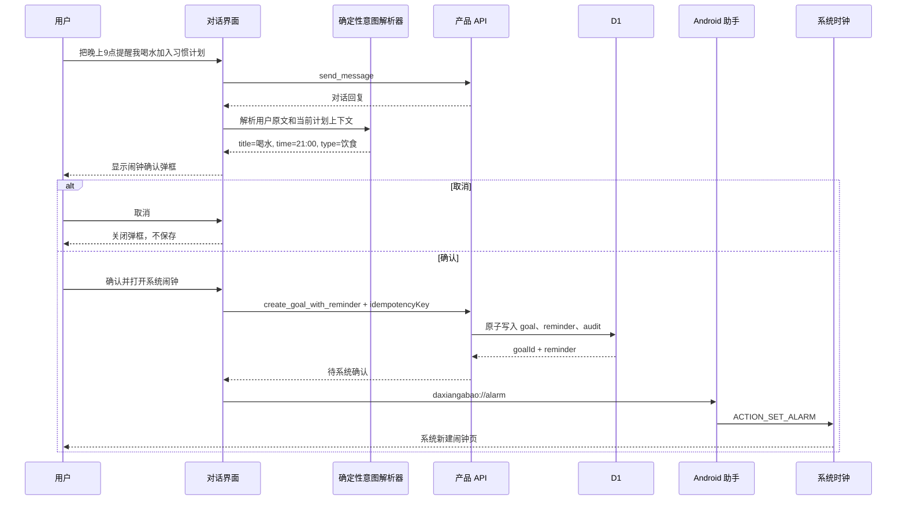

# 对话确认加入“我的闹钟”开发文档

状态：开发完成，待发布与小米 12S Pro 真机验收  
原则：保留现有功能；写操作继续由确定性业务代码和用户确认驱动。

## 1. 目标

当用户在生活对话中明确表达“把某项计划/习惯/任务加入提醒或闹钟”时：

1. 识别任务标题和明确时间。
2. 弹出确认框，请用户确认是否加入“我的闹钟”。
3. 用户取消时关闭弹框，不产生任何数据或系统副作用。
4. 用户确认时创建或关联一条习惯计划，并写入闹钟请求状态。
5. 在 Android 手机上唤起大象阿宝闹钟助手，再由助手打开系统闹钟页面。
6. 用户在系统页确认保存后，由手机系统在目标时间响铃。

## 2. 非目标

- 本期不做医疗提醒、用药提醒或其他高风险健康建议。
- 本期不做 iOS 系统闹钟写入。
- 不从网页读取或同步手机系统闹钟列表。
- 不承诺跨厂商精确删除、编辑或静默创建系统闹钟。
- 不让 DeepSeek 直接执行创建计划或系统闹钟操作；模型只生成对话内容，所有写操作由确定性业务代码和用户确认驱动。

## 3. 现状矩阵

| 能力 | 状态 | 现有位置 | 本次后续处理 |
| --- | --- | --- | --- |
| 连续生活需求对话 | 已有 | `app/page.tsx`、`app/api/product/route.ts` | 保留 |
| 明确的“加入习惯计划”意图识别 | 已有 | `app/habit-plan-intent.ts` | 扩展但不破坏原规则 |
| 计划确认弹框、可编辑标题、取消不保存 | 已有 | `HabitPlanConfirmModal` | 复用交互和可访问性模式 |
| 创建习惯计划 | 已有 | `create_goal` | 保留；新增组合命令时复用校验 |
| 从标题识别中文时间 | 已有 | `app/alarm-reminder.ts` | 复用并扩充测试语料 |
| 计划上的 Android 闹钟开关 | 已有 | `HabitPage.toggleAlarm` | 保留为手动降级路径 |
| Android 深链和系统闹钟桥接 | 已有 | `buildAndroidAlarmIntent`、`MainActivity.java` | 保留 |
| Android 手机主页手动设置闹钟 | 已有 | `MainActivity.showHome/alarmCard` | 保留 |
| 对话中的闹钟意图识别 | 未有 | — | 新增确定性解析器 |
| 对话中的闹钟确认弹框 | 未有 | — | 新增，不与计划确认弹框混用状态 |
| 一次确认后原子创建计划和提醒 | 未有 | — | 新增服务端组合命令 |
| 网页独立“我的闹钟”视图 | 未有 | — | 基于 `goals.reminderJson` 派生，不读取手机闹钟 |
| 系统闹钟创建结果回执 | 未有且 Android 标准接口不可靠 | — | UI 使用“已请求/待确认”状态，不伪造成功 |

## 4. 推荐交互

### 4.1 触发示例

应触发：

- “把晚上9点喝水加入我的闹钟”
- “晚上十点提醒我散步，并放到习惯计划里”
- “把早上七点半起床设成闹铃”
- “把这个计划加个 21:00 的提醒”——只有当前上下文能唯一确定“这个计划”时才触发。

不应触发：

- “给我一个早睡计划”——只有建议，没有明确写入动作。
- “不要设闹钟”或“取消提醒”。
- “每天运动十分钟”——十分钟是时长，不是时间点。
- 没有唯一任务或明确时间的请求；此时只追问一个必要问题，不默认猜测。
- 命中医疗、安全或紧急边界的输入。

### 4.2 确认弹框

弹框字段：

- 标题：`添加到我的闹钟？`
- 计划标题：可编辑，最多 80 字。
- 分类：作息、饮食、运动或日常习惯；允许用户修改。
- 时间：24 小时制，可编辑。
- 说明：`确认后会保存到“我的闹钟”，并打开系统闹钟页面，请在系统页面完成保存。`
- 按钮：`取消`、`确认并打开系统闹钟`。

取消行为必须是纯关闭：不调用创建 API、不修改本地列表、不唤起 Android 助手。

### 4.3 “我的闹钟”状态

建议状态：

- `待系统确认`：服务端已保存请求，但无法证明系统时钟已经保存。
- `已请求系统闹钟`：从 Android 助手返回网页后显示的中性状态；仍不等同于已响铃。
- `已关闭`：项目侧提醒开关已关闭；用户可能仍需在系统时钟中删除对应闹钟。
- `无法识别时间`：只允许编辑，不允许连接系统闹钟。

不要显示未经系统回执证明的“已创建”“已生效”或“到点一定响铃”。

## 5. 目标流程



## 6. 业务解析设计

新增 `app/alarm-plan-intent.ts`，只做确定性解析，不依赖模型是否在回复里声称执行成功。

建议输出：

```ts
type AlarmPlanProposal = {
  title: string;
  type: "作息" | "饮食" | "运动" | "日常习惯";
  hour: number;
  minute: number;
  displayTime: string;
  source: "user_message" | "existing_goal";
};
```

规则优先级：

1. 命中否定语或安全边界：返回 `null`。
2. 必须命中“提醒/闹钟/闹铃/叫我”之一，或“加入计划”与明确时间同时出现。
3. 使用现有 `parseAlarmTimeFromTitle` 解析时间，严禁把持续时长当时间点。
4. 从用户原文移除保存动作词和时间片段后得到候选标题；无法得到可靠标题时要求用户填写，不自动乱填。
5. 只有当前上下文存在唯一计划时，才能解析“这个计划”。

## 7. API 与数据设计

### 7.1 推荐组合命令

新增 `create_goal_with_reminder`，一次请求完成计划与提醒请求写入：

```json
{
  "action": "create_goal_with_reminder",
  "subjectId": "subject_...",
  "type": "饮食",
  "title": "晚上9点喝水",
  "hour": 21,
  "minute": 0,
  "timezone": "device_local",
  "idempotencyKey": "uuid"
}
```

返回：

```json
{
  "goal": { "id": "goal_...", "title": "晚上9点喝水", "type": "饮食" },
  "reminder": {
    "enabled": true,
    "provider": "android_alarm_clock",
    "hour": 21,
    "minute": 0,
    "status": "pending_system_confirmation"
  }
}
```

服务端要求：

- 校验登录身份和 `subjectId` 所有权。
- 重新解析或校验小时、分钟和标题长度，不能信任客户端。
- 使用 D1 batch 原子写入计划、提醒状态和审计事件。
- 使用 `idempotencyKey` 防止重复点击或网络重试生成重复计划。
- 不能接受客户端指定任意 provider、包名或跳转地址。

### 7.2 数据兼容

第一阶段可继续使用现有 `goals.reminderJson`，无需数据库迁移：

```json
{
  "enabled": true,
  "provider": "android_alarm_clock",
  "hour": 21,
  "minute": 0,
  "source": "conversation_confirmation",
  "timezone": "device_local",
  "status": "pending_system_confirmation",
  "requestedAt": "2026-09-01T00:00:00Z"
}
```

“我的闹钟”只展示当前用户、当前主体、活动状态且 `reminderJson.enabled=true` 的计划。若以后需要重复规则、多个提醒、系统回执或跨设备同步，再新增独立 `goal_reminders` 表。

## 8. Android 桥接

保留现有：

- 包名 `com.daxiangabao.health`。
- 深链 `daxiangabao://alarm`。
- `operation=set/show`。
- `AlarmClock.ACTION_SET_ALARM`、`ACTION_SHOW_ALARMS`。
- `EXTRA_SKIP_UI=false`，由系统页面进行最终确认。

新增前应先决定：

- 推荐方案 A：继续显示系统页面。兼容性和可解释性最好，用户需要第二次确认。
- 候选方案 B：把 `EXTRA_SKIP_UI` 改为 `true`。体验更短，但必须在小米、华为、OPPO、vivo、三星和原生 Android 上逐机验证，且仍不能得到统一创建结果回执。

第一版建议采用方案 A。

## 9. 前端状态设计

新增状态应与现有 `planProposal` 分离，避免计划弹框和闹钟弹框互相覆盖：

```ts
const [alarmProposal, setAlarmProposal] = useState<AlarmPlanProposal | null>(null);
const [alarmSaving, setAlarmSaving] = useState(false);
```

确认顺序：

1. 禁用确认按钮，避免重复提交。
2. 调用组合 API。
3. 服务端成功后更新本地 bootstrap。
4. 构造只含允许字段的 Android intent。
5. 跳转 Android 助手。
6. 跳转失败时保留“待系统确认”记录，并显示下载安装/重试入口。

## 10. 错误与降级

| 场景 | 用户表现 | 数据处理 |
| --- | --- | --- |
| 没有明确时间 | 弹框要求补充时间或回到输入框 | 不写数据 |
| 没有可靠标题 | 标题输入框为空，要求用户填写 | 不自动生成标题 |
| 用户取消 | 弹框消失 | 无写入、无深链 |
| API 失败 | 保留弹框内容并提示重试 | D1 原子回滚 |
| 非 Android | 计划可保存；提示仅 Android 可连接系统闹钟 | 提醒状态保持待连接或不启用 |
| 未安装助手 | 打开官方下载页 | 保留“待系统确认” |
| 深链被浏览器拦截 | 显示“打开助手/重新下载” | 不重复创建计划 |
| 系统无时钟处理器 | Android 助手显示错误并返回主页 | 不声称系统闹钟已创建 |
| 重复确认 | 返回同一结果 | 依赖幂等键 |

## 11. 测试计划

### 单元测试

- 闹钟意图的正例、否定语、模糊指代和安全边界。
- 中文/数字/冒号时间、凌晨/中午/晚上、半点/一刻/三刻。
- 时长不被误识别为时间点。
- 标题清洗不产生空标题或模型臆造标题。
- `reminderJson` 新旧格式兼容。

### API 测试

- 未登录、跨用户和无效主体拒绝。
- 组合写入成功和原子回滚。
- 幂等请求只生成一条计划。
- 审计记录不包含敏感对话原文。

### UI 测试

- 确认框键盘焦点、Esc/关闭、取消、保存中状态和错误恢复。
- 确认后“我的闹钟”立即出现一条任务。
- 返回对话后上下文不丢失。
- 非 Android、未安装助手和深链失败的降级入口。

### 真机测试

- 小米 12S Pro（用户当前系统版本）。
- 至少再覆盖一台原生 Android 和一台其他厂商 Android。
- 验证前台、锁屏、静音/勿扰、重启后、时区变化和跨午夜。

## 12. 分阶段实施

### P0：文案和既有能力显性化

- 在手机版预览和产品说明中展示“快速设置闹钟”“我的闹钟”和系统确认边界。
- 保留原有对话、计划确认、计划筛选、打卡、删除和手动闹钟开关。

状态：已完成。

### P1：对话确认链路

- 新增确定性闹钟意图解析器。
- 新增闹钟确认弹框。
- 新增组合 API 与幂等键。
- 新增“我的闹钟”派生列表。

状态：已完成。确认弹框还增加了“同时设置系统闹钟”授权开关；关闭后只加入习惯计划。

### P2：Android 体验与真机验收

- 完成小米 12S Pro 真机验证。
- 增加深链失败、未安装和系统无处理器的恢复入口。
- 决定是否保留系统二次确认。

状态：待真机执行；当前继续保留系统二次确认。

### P3：可选增强

- 重复规则、编辑提醒、多个提醒和跨设备状态。
- 仅在业务确有需要且符合平台政策时评估应用自行调度精确闹钟。

## 13. 开发前必须确认的产品决定

1. 用户在网页确认后，是否接受仍需在系统时钟页面再点一次保存？建议接受。
2. “我的闹钟”显示“已请求”还是“待系统确认”？建议默认“待系统确认”。
3. 没有明确时间时，是在弹框补填时间还是返回对话追问？建议弹框补填。
4. 只有闹钟、不需要习惯计划的请求，是否仍创建一条计划？建议创建统一的计划记录，避免出现两套任务数据源。
