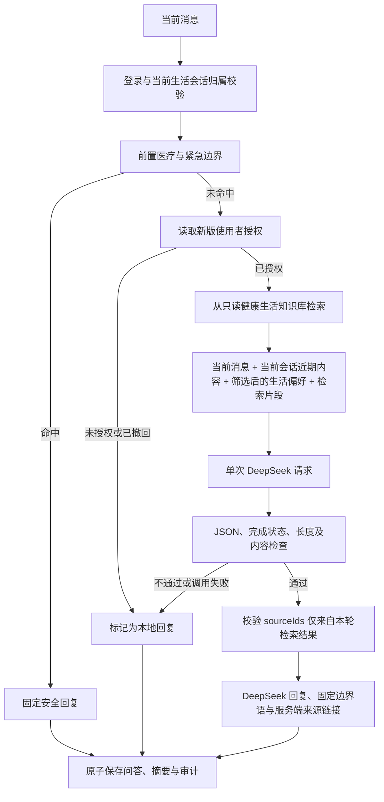

# 大象阿宝生活需求对话实现契约

## 本次已确认的变更

用户明确要求在现有对话框接入 DeepSeek 需求对话，并确认在使用者授权后，将本次输入、当前对话最近最多 12 条消息和主动保存的生活偏好发送给 DeepSeek。后续要求按项目主体生成 RAG，因此服务端还会发送本轮检索到的公开健康生活资料片段，并把实际使用的权威来源展示给用户。此决定替代此前“仅为固定行动排序、不发送原文”的限制；保留非医疗范围及其他页面功能。

## 目标与范围

面向普通成年人，通过问候、理解目标、少量追问和连续补充，形成可开始的饮食、作息、运动与日常习惯建议。每轮最多问 1–2 个问题，不强制每轮输出行动清单。明确的医疗、药品、检查、特殊人群或紧急请求不进入普通建议流程。模型没有工具权限，不能创建计划、修改数据或声称已经执行操作。

## 数据流

## 授权与上下文

- 新范围为 `external_ai_conversation_v1`；旧 `external_ai_processing` 不授权对话原文传输。
- 每次服务端发送都重新读取当前主体的最新授权。相同时间的冲突记录以撤回优先；撤回不能取消已发出的请求。
- 首次发送和隐私页授权都说明发送目的、接收方和具体数据；拒绝后可使用本地回复，在隐私页主动重新授权。
- 原文最多 2000 字符。即使没有主动附带身份，用户自行写入的个人信息也可能随原文发送，界面提醒勿输入敏感内容。
- 上下文只能由服务端从当前已校验归属、`productScope=lifestyle` 的会话读取，查询最近 12 条，模型实际历史最多 12 条且总计不超过 8000 字符。
- 仅包含本次新版流程产生的完整用户/助手问答对；不附带历史本地降级、拦截、安全中止、旧版记录或自定义 system/tool 消息。
- 偏好只挑选合法时间、既定饮食/运动/活动时长选项和通过既有生活词汇检查的短目标。其他 profile 字段、身份和旧医疗档案不发送。
- RAG 检索只在进程内的公开、只读语料上运行，不写入用户内容、不建立用户向量索引，也不需要新的第三方检索服务。
- 客户端不能指定模型、密钥、历史或 profile；密钥仅保留在服务端。审计只记录类别、来源、状态与固定错误码，不记录密钥或服务商原始错误正文。

## 模型及失败处理

继续使用现有 Vinext、React、D1、R2 和 DeepSeek，无新框架或数据库迁移。RAG 采用关键词与领域信号加权的确定性检索，每轮最多注入 3 个片段。请求使用已配置模型（默认 deepseek-v4-pro）、JSON 输出、非思考模式、最多 1200 输出 token、18 秒超时，不自动重试。

严格校验完整 JSON、响应完成状态、回复长度及允许的类型/类别。医疗与紧急类型始终替换成服务端固定语；普通文本还经过禁止内容及链接/HTML 检查。知识库命中时，推荐必须至少返回一个本轮允许的来源 ID；未知 ID 被丢弃，缺少有效引用则整轮降级。本地保存的只有来源 ID，历史读取时重新映射到服务端白名单标题和 HTTPS 链接。React 作为纯文本展示，不执行模型 HTML 或代码。

| 状态 | 页面表现 |
| --- | --- |
| connected | DeepSeek 回复 |
| consent_required | 尚未授权 DeepSeek · 本地回复，并指引隐私入口 |
| unavailable | DeepSeek 暂未连接 · 本地回复，并提示重试/检查配置 |
| safety_boundary | 本地安全提示；模型识别的边界则标记 DeepSeek 回复并展示固定边界语 |

问答两条消息、会话摘要和审计通过 D1 batch 原子保存；失败不留半条问答。首次会话标题保持不变。发送失败保留输入，中文输入法确认候选词不会误发送。

## 验证与已知限制

- 单元验证覆盖多轮问答、原文/历史请求体、最小偏好、旧授权不沿用、撤回、边界不调用模型、缺少密钥、401/402/429/500、超时、无效 JSON、截断、HTML 和危险输出。
- 集成验证使用真实构建后的 API 路由、模拟平台绑定及内存 SQLite，检查未登录/跨用户/旧医疗会话隔离、多轮保存、服务端上下文、撤回和原子回滚。无生产数据或真实密钥参与。
- RAG 单元验证覆盖饮食、睡眠、运动、一天计划和习惯检索，空检索、上下文长度、虚构来源丢弃与历史来源白名单恢复；集成验证同时检查来源保存和读取。
- 当前语料是人工核验的公开资料快照，不会自动追踪来源修订；更新依据和高风险误写清单见 [RAG 权威来源研究](rag-source-research.md)，应定期复核。
- 既有规则测试是本地回退基线，不代表 DeepSeek 生成质量或所有医疗表达的准确率。自由生成扩大了输出空间，关键词和提示词不能保证零漏检，仍需更广泛真实问法评估。
- 云端秘密变量不可读；模拟调用通过不等于生产密钥有效。公开发布前需确认，发布后需用真实服务验证连通性。
- 本次不引入并发会话锁、请求幂等键、跨设备同步或限流策略；同一会话多窗口同时发送可能缺少对方尚未完成的轮次。
- 旧数据不自动删除；账号删除仍先完成对象存储清理，再删除数据库记录。
